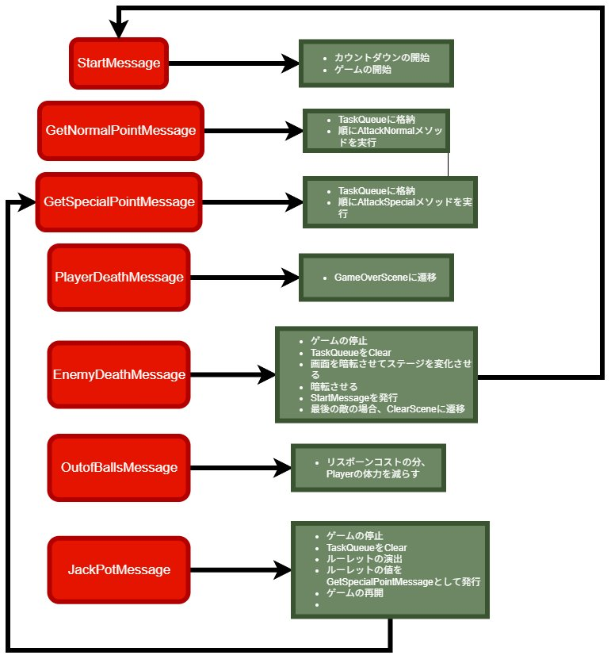
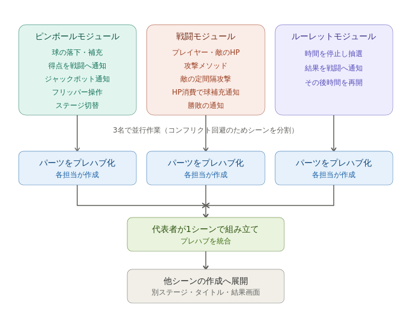

# 林 聡太 — 開発ポートフォリオ

就職活動用に、これまでチームおよび個人で制作したものをまとめています。
Unity（C#）でのゲーム開発を中心に、個人でのコード実装と、チームでの
設計・とりまとめの双方を経験してきました。

---

## 制作物

### 1. NIGHTDRIVE（ノベル型ホラーゲーム / 2人制作）

急いで目的地へ向かう主人公の前に、立ちふさがるものが現れる——
ノベル型のホラーゲームです。友人との2人チームで制作しました。

- **担当**: メインプログラマー（コードはすべて私が記述）
- **共同制作者の担当**: デザイン・ストーリー
- **使用技術**: Unity / C#
- **プレイ**: [<!-- TODO: UnityRoom の作品URLをここに記載 -->](https://unityroom.com/games/nightdrive)

> 本作は2人での共同制作物です。プログラムは私がすべて記述しました。
> デザイン・ストーリーは共同制作者が担当しています。

---

### 2. PRPG（ピンボール×RPG / 9人チーム制作）

ピンボールで得点を稼ぎ、その得点で敵を倒していく「ピンボール×RPG」
ゲームです。約2か月、9人チームで制作しました。

- **担当**: 全体設計（ゲーム構造の分割と統合方針の策定、仕様の取りまとめ）
- **使用技術**: Unity / C#
- **プレイ**: [<!-- TODO: UnityRoom の作品URLをここに記載 -->](https://unityroom.com/games/prpg)

#### 担った設計

ゲームシーンを **ピンボール / 戦闘 / ルーレット** の3モジュールに分割し、
それぞれを別メンバーが並行して開発できる体制を設計しました。9人での
並行開発でGitのコンフリクトが起きやすい点を事前の課題と捉え、

- 作業するシーンをモジュール単位で分割しコンフリクトを構造的に回避
- 各自が担当パーツをプレハブ化し、代表者が1シーンで統合する手順を策定

という統合方針を定め、仕様書として共有しました。

**イベント設計（メッセージ駆動）**

ゲーム内の各イベントをメッセージとして定義し、それぞれに対する処理を
設計しました。下図は私が作成した、全イベントを網羅した設計図です。

**モジュール構成と統合の流れ**

> 本作は9人での共同制作物のため、ソースコードは公開していません。
> 上記は私が担当した設計部分について記載しています。

---

### 3. UIアクションゲーム（9人チーム制作 / リードプログラマ）

さまざまなジャンルのUIで遊ぶミニゲーム集です。BitSummitGameJam
（約3か月）で、9人チームのリードプログラマとして制作しました。

- **担当**: リードプログラマ（全体設計・作業分担・職種間の橋渡し・実装）
- **使用技術**: Unity / C# / Windowsビルド
- **紹介動画 (itch.io)**: [<!-- TODO: itch.io の紹介動画URLをここに記載 -->](https://bitsummit-gamejam.itch.io/uityantowakaiseyo)

> 本作はWindows向けにビルドしており、ブラウザ実行はできません。
> プレイ内容は itch.io の紹介動画で確認できます。
> 9人での共同制作物のため、ソースコードは公開していません。

---

## 使用言語

- **普段よく使う言語**: C#（Unityでのゲーム開発）
- **開発経験のある言語**: Java（Android Studioで加速度センサーを用いた
  筋トレ補助アプリを開発 / 大学講義）
- **学習経験のある言語**: Python（大学講義。素因数分解の処理を自分で実装）

---
